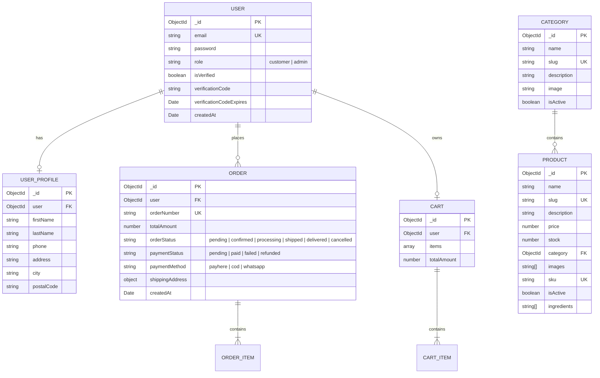

# AURA — Luxury Cosmetics & E-Commerce Platform

A full-stack, high-performance luxury cosmetics e-commerce platform built with modern web technologies, cinematic product storytelling, responsive administration, and secure online payment processing.

---

## 1. Technologies Used

### Frontend
- **Framework & Runtime**: [React 19](https://react.dev/) with [Vite 8](https://vite.dev/)
- **Language**: [TypeScript](https://www.typescriptlang.org/) (strict mode)
- **Styling**: [Tailwind CSS v4](https://tailwindcss.com/) with custom `@theme` brand tokens
- **Routing**: [React Router v7](https://reactrouter.com/) (declarative nested routes, lazy loading)
- **Icons & UI**: [Lucide React](https://lucide.dev/), [React Hot Toast](https://react-hot-toast.com/)
- **HTTP Client**: [Axios](https://axios-http.com/) (with interceptors for credentials and auth)

### Backend
- **Runtime**: [Node.js](https://nodejs.org/) (ES Modules)
- **Framework**: [Express v5](https://expressjs.com/)
- **Language**: [TypeScript](https://www.typescriptlang.org/) with [tsx](https://github.com/privatenumber/tsx) execution
- **Database & ODM**: [MongoDB](https://www.mongodb.com/) with [Mongoose v9](https://mongoosejs.com/)
- **Authentication**: [JSON Web Tokens (JWT)](https://jwt.io/), [bcryptjs](https://github.com/dcodeIO/bcrypt.js), `cookie-parser`
- **File Uploads**: [Multer](https://github.com/expressjs/multer) & [Cloudinary v2](https://cloudinary.com/)
- **Email Service**: [Nodemailer](https://nodemailer.com/) (SMTP security codes and order updates)
- **Payment Gateway**: [PayHere](https://www.payhere.lk/) (Sandbox & Production with MD5 signature validation)

---

## 2. Setup Process

### Prerequisites
- **Node.js**: v18.0.0 or higher
- **npm**: v9.0.0 or higher
- **MongoDB**: Local instance or MongoDB Atlas connection URI

### Installation & Configuration

1. **Clone the repository**:
   ```bash
   git clone <repository-url>
   cd cosmetics-ecommerce
   ```

2. **Backend Setup**:
   ```bash
   cd server
   npm install
   ```

   Create a `.env` file in the `server/` directory:
   ```env
   PORT=5000
   NODE_ENV=development
   CLIENT_URL=http://localhost:5173

   # Database
   MONGODB_URI=mongodb://localhost:27017/cosmetics-ecommerce

   # Authentication
   JWT_SECRET=your_jwt_super_secret_key_here
   JWT_EXPIRE=7d

   # Cloudinary (Media storage)
   CLOUDINARY_CLOUD_NAME=your_cloud_name
   CLOUDINARY_API_KEY=your_api_key
   CLOUDINARY_API_SECRET=your_api_secret

   # SMTP Email Service
   EMAIL_HOST=smtp.gmail.com
   EMAIL_PORT=587
   EMAIL_USER=your_email@gmail.com
   EMAIL_PASS=your_app_password
   EMAIL_FROM="AURA Atelier <no-reply@aura.com>"

   # PayHere Payment Gateway
   PAYHERE_MERCHANT_ID=your_merchant_id
   PAYHERE_SECRET=your_merchant_secret
   PAYHERE_MODE=sandbox
   ```

3. **Database Seeding**:
   ```bash
   # Seed default administrator account
   npm run seed:admin

   # Seed initial product catalog & categories
   npm run seed:products
   ```

4. **Frontend Setup**:
   ```bash
   cd ../client
   npm install
   ```

   *(Optional)* Create a `.env` file in `client/`:
   ```env
   VITE_API_URL=http://localhost:5000/api
   ```

5. **Running Locally**:
   - **Backend**: In `server/`, run `npm run dev` (starts server on `http://localhost:5000`)
   - **Frontend**: In `client/`, run `npm run dev` (starts client on `http://localhost:5173`)

---

## 3. Architecture

The application adopts a **Decoupled Client-Server Architecture** communicating via RESTful JSON APIs:

```
┌────────────────────────────────────────────────────────┐
│                   CLIENT (React 19 + Vite)              │
├──────────────────────────┬─────────────────────────────┤
│   Customer Layout        │       Admin Portal          │
│   - Cinematic Video Hero │       - Dashboard Analytics │
│   - Product Showcase     │       - Catalog Management  │
│   - Cart & Checkout      │       - Orders Management   │
├──────────────────────────┴─────────────────────────────┤
│   Context State (AuthContext, CartContext, Confirm)    │
│   Axios Interceptor Layer (Credentials / Bearer Token) │
└───────────────────────────▲────────────────────────────┘
                            │ HTTPS / JSON
┌───────────────────────────▼────────────────────────────┐
│                    SERVER (Express 5)                  │
├────────────────────────────────────────────────────────┤
│   Middleware: Auth Check, Roles, Error Handler, Multer  │
├────────────────────────────────────────────────────────┤
│   Controllers: Auth, Products, Categories, Orders, Pay │
├────────────────────────────────────────────────────────┤
│   Mongoose Data Layer                                  │
└───────────────────────────▲────────────────────────────┘
                            │
┌───────────────────────────▼────────────────────────────┐
│           MongoDB Database & External Services         │
│   - Cloudinary (CDN)     - Nodemailer (SMTP)           │
│   - PayHere (Gateway)                                  │
└────────────────────────────────────────────────────────┘
```

- **Frontend Structure**:
  - `src/components/`: Reusable modular UI components divided by domain (`common/`, `customer/`, `home/`, `admin/`, `product/`).
  - `src/context/`: Centralized reactive state for Authentication, Cart management, and Confirmation modals.
  - `src/pages/`: Code-split customer and administrative page views.
  - `src/services/`: Modular API service clients with centralized request configuration.
- **Backend Structure**:
  - `src/routes/`: Express endpoint declarations mapped to authentication guards.
  - `src/controllers/`: Business logic, validation, and HTTP response handling.
  - `src/models/`: Strongly-typed Mongoose data schemas.
  - `src/middleware/`: JWT verification, role-based access enforcement, and error normalization.

---

## 4. Database Design



---

## 5. Important Technical Decisions

1. **Tailwind CSS v4 Brand Design System**:
   - Replaced ad-hoc utility hex values with a curated, semantic `@theme` design token hierarchy (`--color-brand-bg`, `--color-brand-gold`, `--color-brand-surface`, etc.) to guarantee cohesive luxury aesthetics across dark and light components.
2. **React Portal for Modal Dialogs (`createPortal`)**:
   - All critical modals (product deletion, category management, order inspector, global confirmations) mount directly to `document.body`. This eliminates stacking context and containing block traps caused by CSS page transitions (`transform` / `will-change`).
3. **Dual Authentication Transport**:
   - Auth tokens are delivered via secure `httpOnly` cookies as well as Bearer headers in responses, ensuring strong XSS resistance in browser clients while maintaining compatibility with API testing tools.
4. **PayHere Signature Verification**:
   - Implemented server-side MD5 signature generation and webhook checksum verification to ensure payment statuses cannot be spoofed on the client side.
5. **Optimistic & Resilient Media Delivery**:
   - High-resolution cinematic hero video backgrounds and local product assets include seamless fallback posters and placeholder handlers on image load failures.

---

## 6. Security Approach

- **Password Storage**: Passwords are encrypted using `bcryptjs` with salt rounds before database persistence.
- **Role-Based Access Control (RBAC)**: Protected admin endpoints enforce role validation (`req.user.role === 'admin'`) via server middleware.
- **Cross-Site Scripting (XSS) & Injection Protection**:
  - Strict Mongoose schema casting and parameterized MongoDB queries protect against NoSQL injection.
  - Sensitive authentication credentials stored in `httpOnly`, `sameSite: "lax"`, and TLS-aware cookies.
- **Payload & Input Validation**:
  - Explicit frontend and backend checks for all registration and modification forms (including mandatory password confirmation match checks, email regex, string sanitation).
- **CORS Configuration**: Restricts origin requests strictly to the configured client domain with explicit credential allowances.

---

## 7. Assumptions & Limitations

- **Currency & Localization**: Tailored primarily for the Sri Lankan luxury beauty market with **LKR** as the primary display currency and PayHere as the primary digital gateway.
- **Stock Reservation**: Inventory decrement takes place upon order placement/confirmation rather than temporary cart reservation.
- **Media Hosting**: Requires an active Cloudinary account for persistent admin-uploaded product imagery; seeded catalog data defaults to optimized local assets.
- **Single Currency Model**: Multi-currency conversion is not enabled in the current checkout pipeline.